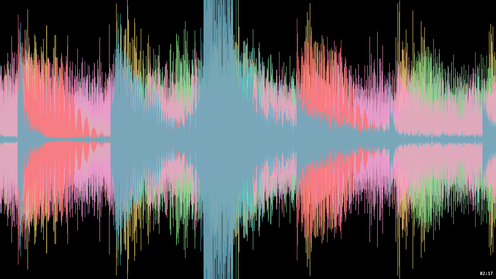
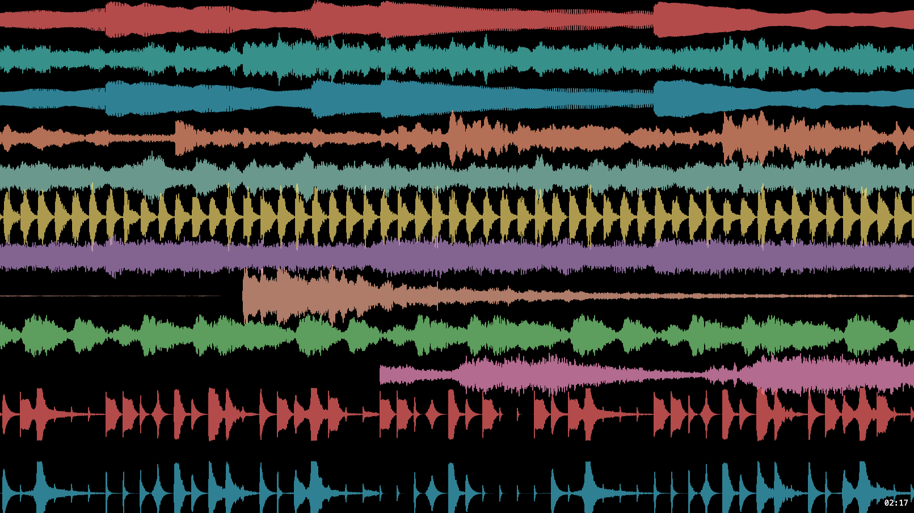
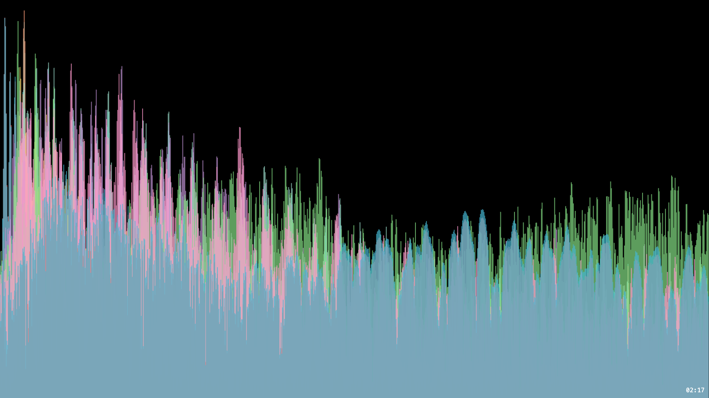
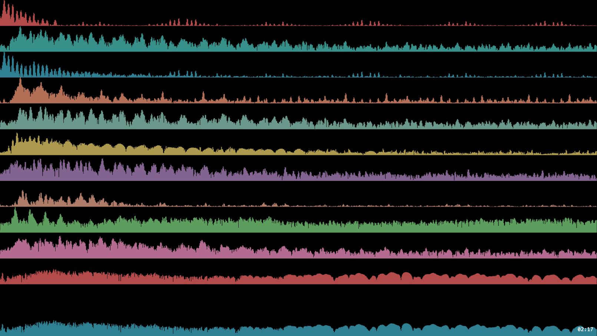
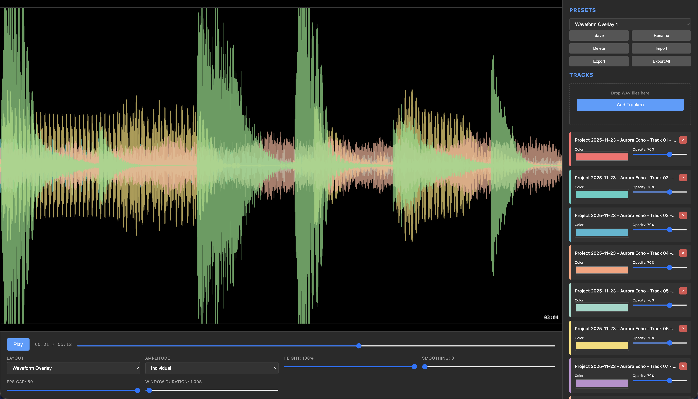
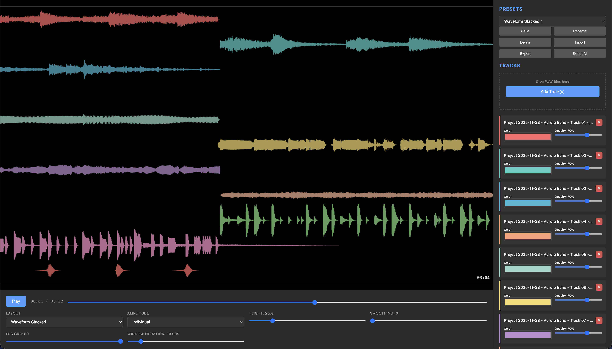
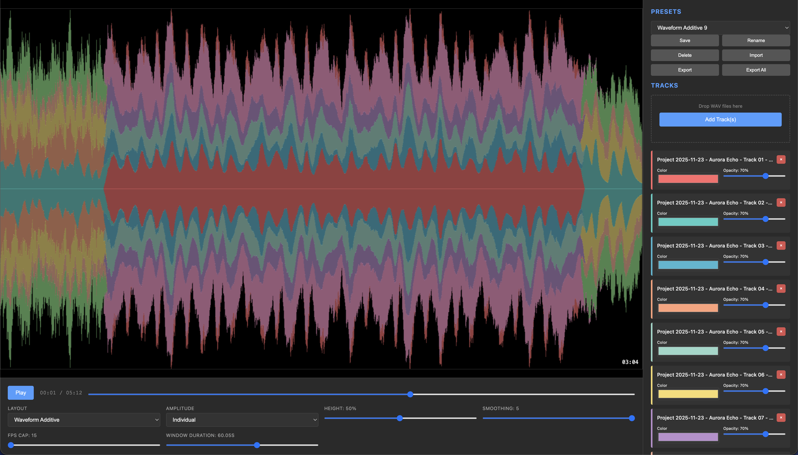
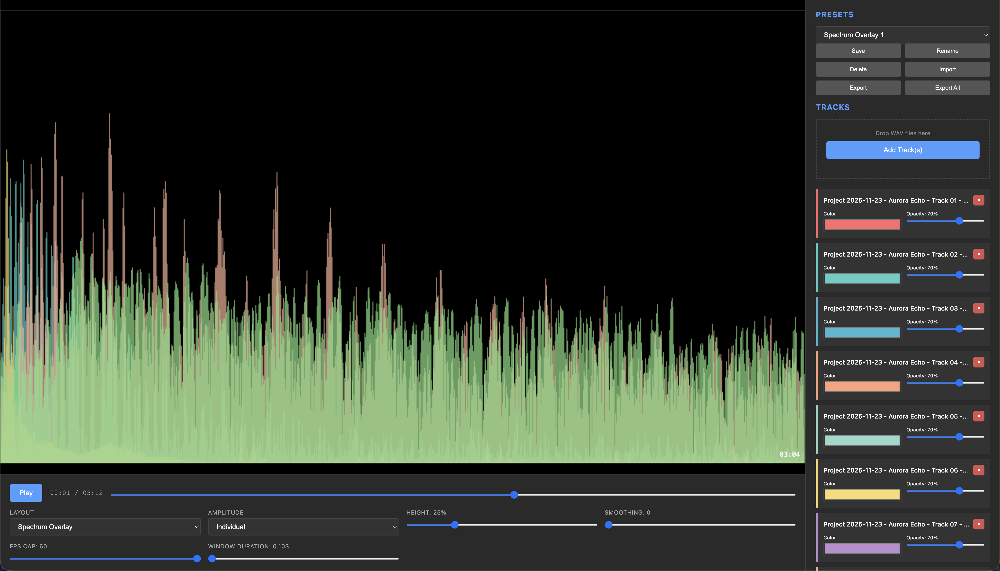

<p align="center">
  
</p>

# Multi-Track Audio Visualizer

<!-- BADGES:START -->

[](LICENSE.md)
[](CONTRIBUTING.md)
<!-- BADGES:END -->

## Table of Contents

- [Description](#description)
- [Screenshots](#screenshots)
  - [Output examples](#output-examples)
  - [Interface](#interface)
- [Features](#features)
- [Requirements](#requirements)
- [Installation](#installation)
- [Usage](#usage)
  - [Loading tracks](#loading-tracks)
  - [Playback](#playback)
  - [Styling the tracks](#styling-the-tracks)
  - [Presets](#presets)
  - [Exporting from the browser](#exporting-from-the-browser)
  - [Exporting from the command line](#exporting-from-the-command-line)
- [Troubleshooting](#troubleshooting)
- [Architecture](#architecture)
- [Credits](#credits)
- [Contributing](#contributing)
- [License](#license)

## Description

Load the stems of a song, one WAV file per instrument, and this app draws them
together in real time: overlaid or stacked waveforms, or frequency spectra,
each track in its own colour. When it looks right, export it as a 1920×1080
video with all the tracks mixed into the soundtrack.

The visualiser runs in the browser. A command-line exporter shares the same
rendering code and uses your system's ffmpeg, for batch jobs and faster renders.

**Try it at
[multitrack-audio-visualizer.geoffmyers.com](https://multitrack-audio-visualizer.geoffmyers.com)**:
load your own stems, or press **Load demo tracks** for a short synthesised
piece. Your files stay in your browser.

## Screenshots

### Output examples

| Waveform overlay | Waveform additive |
|---|---|
|  |  |
| **Waveform stacked** | **Spectrum overlay** |
|  |  |
| **Spectrum stacked** | |
|  | |

### Interface

| Waveform overlay | Waveform stacked |
|---|---|
|  |  |
| **Waveform additive** | **Spectrum overlay** |
|  |  |

## Features

- **Any number of tracks**, loaded together and played in sync
- **Five layouts**: waveform overlay, waveform additive, waveform stacked,
  spectrum overlay and spectrum stacked
- **A scrolling oscilloscope view**: each frame shows the audio just before the
  playhead, redrawn 60 times a second
- **Per-track colour and opacity**, and a choice of normalising each track on
  its own or all tracks together
- **Controls for height, smoothing and window length**
- **20 built-in presets**, plus your own: save, rename, delete, import and export
  them as JSON
- **Video export in the browser** to 1920×1080, 60 fps MP4 (H.265) with the
  tracks mixed to AAC audio, using ffmpeg compiled to WebAssembly
- **A command-line exporter** for batch work, with H.264 or H.265, adjustable
  quality and frame rate, and config files
- **Drag and drop** loading, and the space bar for play and pause

## Requirements

**Browser app**

- **Node.js 20.19+** (or 22.12+), which Vite 7 needs, and npm
- A current Chrome, Edge, Firefox or Safari with the Web Audio API
- For in-browser export: a page served with the cross-origin isolation headers
  that `SharedArrayBuffer` needs (see
  [Exporting from the browser](#exporting-from-the-browser))

**Command-line exporter**

- **ffmpeg** on your `PATH`, for example `brew install ffmpeg` or
  `sudo apt install ffmpeg`
- The build tools for [node-canvas](https://github.com/Automattic/node-canvas),
  only on platforms where npm cannot download a prebuilt binary

Input files must be **WAV**.

## Installation

```bash
git clone https://github.com/geoffmyers/multitrack-audio-visualizer.git
cd multitrack-audio-visualizer
npm install
npm run dev
```

Open [http://localhost:3000](http://localhost:3000).

To build a static copy for hosting:

```bash
npm run build        # type-checks, then writes dist/
npm run preview      # serves dist/ locally
```

## Usage

### Loading tracks

Click **Add Track(s)**, or drag WAV files onto the drop zone. Several files can
be added at once, and each gets its own colour.

A deployment can offer a **Load demo tracks** button by serving
`demo/tracks.json` next to `index.html`, listing WAV files in the same folder:

```json
{ "tracks": [{ "file": "drums.wav", "name": "Drums" }, { "file": "bass.wav", "name": "Bass" }] }
```

Without that file the button stays hidden.

### Playback

- **Play / Pause** with the button or the **space bar**
- **Seek** by dragging the timeline
- The time display shows the current position and the total length

The view is a rolling window: it shows the audio leading up to the playhead,
and a white line marks the playhead itself.

### Styling the tracks

Each track has a **colour** picker, an **opacity** slider and a **×** to remove
it. The layout menu switches between the five layouts, and the amplitude menu
chooses between **Individual** (each track scaled to its own peak) and
**Normalized** (all tracks scaled to the loudest).

### Presets

Pick a preset from the menu to apply a complete look. **Save** stores the
current settings as a new preset, and **Rename**, **Delete**, **Import**,
**Export** and **Export All** manage them. Your presets are kept in the
browser's local storage; the 20 built-in ones are in
`presets/all-presets.json`.

### Exporting from the browser

1. Load and style your tracks.
2. Click **Export Video (MP4/H.265)** and wait for the progress bar.
3. The video downloads when it is done: 1920×1080, 60 fps, H.265, with AAC
   audio at 192 kbit/s.

In-browser export needs `SharedArrayBuffer`, which browsers only provide on a
page served with these headers:

```
Cross-Origin-Opener-Policy: same-origin
Cross-Origin-Embedder-Policy: require-corp
```

The development server in `vite.config.ts` already sends them. Configure the
same headers on any server that hosts `dist/`.

### Exporting from the command line

The CLI renders with the same code and encodes with your system's ffmpeg, which
is much faster than the browser.

```bash
# The built-in presets and their settings
npm run export -- list-presets
npm run export -- show-preset "Waveform Overlay 1"

# Export from arguments
npm run export -- export \
  --audio "drums.wav,bass.wav,keys.wav" \
  --preset "Waveform Overlay 1" \
  --output song.mp4

# Export from a config file (copy example-export-config.json and edit the paths)
npm run export -- export --config my-export.json --output song.mp4
```

| Option | What it does |
|---|---|
| `-c, --config <path>` | Read settings from a JSON file |
| `-a, --audio <files>` | Comma-separated WAV files |
| `-p, --preset <name>` | Start from a preset |
| `-o, --output <path>` | Output file (default: the config file's `output`, else `output.mp4`) |
| `--layout <mode>` | `overlay`, `overlay-additive`, `stacked`, `spectrum-overlay` or `spectrum-stacked` |
| `--amplitude-mode <mode>` | `individual` or `normalized` |
| `--height <percent>`, `--smoothing <0-5>`, `--window-duration <seconds>` | Visual overrides |
| `--fps <n>`, `--codec <h264\|h265>`, `--quality <crf>`, `--audio-bitrate <rate>` | Encoding overrides |
| `--max-frames <n>` | Stop after n frames, for a quick test |
| `-v, --verbose` | Detailed logging |

Options given on the command line override the same settings in a config file;
anything you leave out keeps the config file's value.

[docs/CLI_README.md](docs/CLI_README.md) documents the config file format and
hardware-accelerated encoding in full.

## Troubleshooting

**Audio will not play.** Click the page first, since browsers only start audio
after a user action, and check that the files are valid WAV.

**Export fails.** Check that the page is served with the two headers above and
that your browser supports `SharedArrayBuffer`. Try a shorter file, and look for
ffmpeg errors in the browser console. For long or large exports, use the CLI.

**Playback stutters.** Use fewer tracks at once and close other tabs.

**A file will not load.** Only WAV is supported, and very large files take a
while to decode.

## Architecture

```
WAV files ──► AudioEngine (Web Audio API) ──► AudioTrack per file
                    │                              │
                    │ synchronised playback        │ waveform / FFT for the current window
                    ▼                              ▼
               RenderLoop (60 fps) ─────────► WaveformRenderer ──► <canvas> 1920×1080
                                                   │
                           VideoExporter ◄─────────┘  frame by frame
                                 │
                                 └──► export.worker.ts (ffmpeg.wasm) ──► MP4

cli/ ──► CLIAudioEngine / CLIAudioTrack (no DOM) ──► same renderer on node-canvas ──► system ffmpeg
```

| Path | Role |
|---|---|
| `src/core/` | `AudioEngine` (loading, synchronised playback, seeking), `AudioTrack` (per-window waveform and spectrum), `PresetManager` |
| `src/rendering/` | `WaveformRenderer` for all five layouts, and the 60 fps `RenderLoop` |
| `src/export/` | `VideoExporter`, `FrameCapture` and the ffmpeg.wasm Web Worker |
| `src/ui/` | Playback, per-track, preset and export controls |
| `src/visualization/`, `src/utils/` | Colours, file loading and time formatting |
| `cli/` | The command-line exporter and its DOM-free adapters |
| `presets/`, `public/presets/` | The built-in presets |
| `public/ffmpeg/` | The ffmpeg WebAssembly core |
| `docs/` | CLI guide, quick start and visualisation details |

`npm test` runs the Vitest suite, and `npm run quality` runs type-checking,
linting and tests together. See [ARCHITECTURE.md](ARCHITECTURE.md) and
[docs/VISUALIZATION_DETAILS.md](docs/VISUALIZATION_DETAILS.md) for more detail.

## Credits

- Built with [TypeScript](https://www.typescriptlang.org/) and
  [Vite](https://vite.dev/), on the browser's Web Audio and Canvas APIs.
- In-browser encoding by [ffmpeg.wasm](https://ffmpegwasm.netlify.app/). The
  core in `public/ffmpeg/` is an FFmpeg build configured with `--enable-gpl`,
  `libx264` and `libx265`, so it is GPL-2.0-or-later; its source is published by
  the [ffmpeg.wasm project](https://github.com/ffmpegwasm/ffmpeg.wasm).
- Command-line encoding by [FFmpeg](https://ffmpeg.org/), with rendering by
  [node-canvas](https://github.com/Automattic/node-canvas), WAV decoding by
  [wav-decoder](https://github.com/mohayonao/wav-decoder), and
  [Commander](https://github.com/tj/commander.js) and
  [cli-progress](https://github.com/npkg/cli-progress) for the interface.
- Tests by [Vitest](https://vitest.dev/) with
  [happy-dom](https://github.com/capricorn86/happy-dom).
- The README icon is the [Font Awesome](https://fontawesome.com/) `wave-square` glyph,
  used under [CC BY 4.0](https://creativecommons.org/licenses/by/4.0/).

Written by Geoff Myers.

## Contributing

Bug reports and pull requests are welcome. See [CONTRIBUTING.md](CONTRIBUTING.md)
for setup, checks and how this repository is published.

## License

This program is free software: you can redistribute it and/or modify it under
the terms of the GNU General Public License as published by the Free Software
Foundation, either version 3 of the License, or (at your option) any later
version.

This program is distributed in the hope that it will be useful, but WITHOUT ANY
WARRANTY; without even the implied warranty of MERCHANTABILITY or FITNESS FOR A
PARTICULAR PURPOSE. See [LICENSE.md](LICENSE.md) for the full text of the GNU
General Public License.

SPDX-License-Identifier: `GPL-3.0-or-later`
